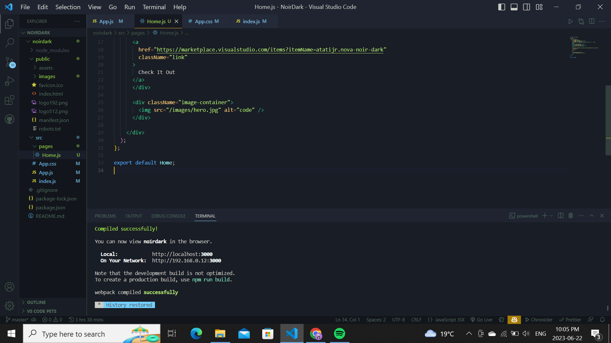

# Dark Green Theme for Visual Studio Code

## Overview
The Dark Green Theme is a visually striking and elegant color scheme designed specifically for Visual Studio Code. It offers a soothing dark green palette that provides a unique and immersive coding experience.

## Features
- Beautiful and harmonious dark green color scheme
- Thoughtfully chosen syntax highlighting for various programming languages
- Consistent and readable typography
- Optimized for improved focus and productivity

## Installation
To install the Dark Green Theme in Visual Studio Code, follow these steps:
1. Launch Visual Studio Code.
2. Go to the Extensions view (Ctrl+Shift+X).
3. Search for "Nova noir" and click on the install button.
4. Once installed, go to the Preferences (File > Preferences) and select "Color Theme".
5. Choose the "Dark Green Theme" from the list of available themes.

## Customization
The Noir Dark Green Theme can be easily customized to suit your preferences. To make modifications:
1. Go to the Preferences (File > Preferences) and select "Settings".
2. Search for "Dark Green Theme" in the settings search bar.
3. Adjust the theme's settings, such as the brightness or contrast, to your liking.

## Usage and Tips
- Use keyboard shortcuts and Visual Studio Code's powerful features to enhance your coding experience with the Dark Green Theme.
- Customize your editor layout and font settings to complement the theme and maximize readability.

## Contribution
Contributions to the Dark Green Theme are welcome! If you encounter any issues or have suggestions for improvements, please submit them through the GitHub issue tracker.

## License
This theme is licensed under the [MIT License](LICENSE).

## Related Links
- [Live Site](https://novanoir.vercel.app/)
- [Visual Studio Code Marketplace](https://marketplace.visualstudio.com/items?itemName=atatijr.nova-noir-dark)

Enjoy coding with the Dark Green Theme!
